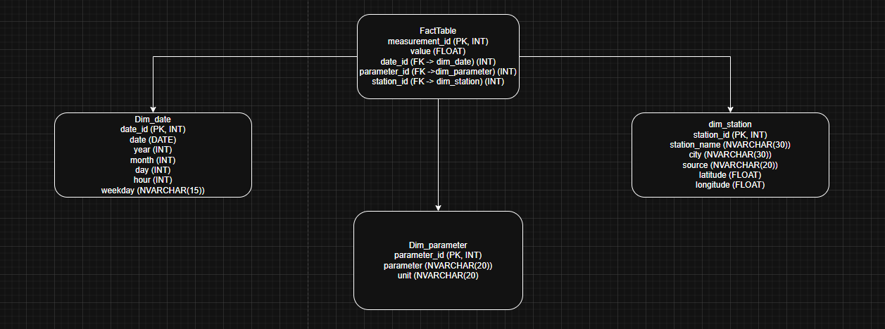
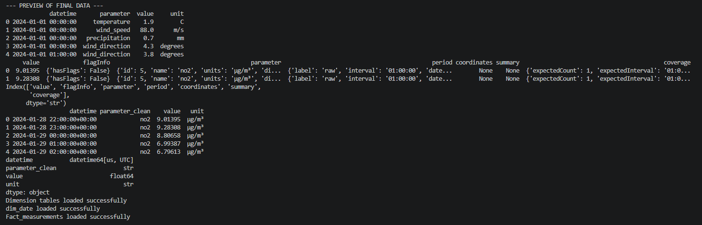
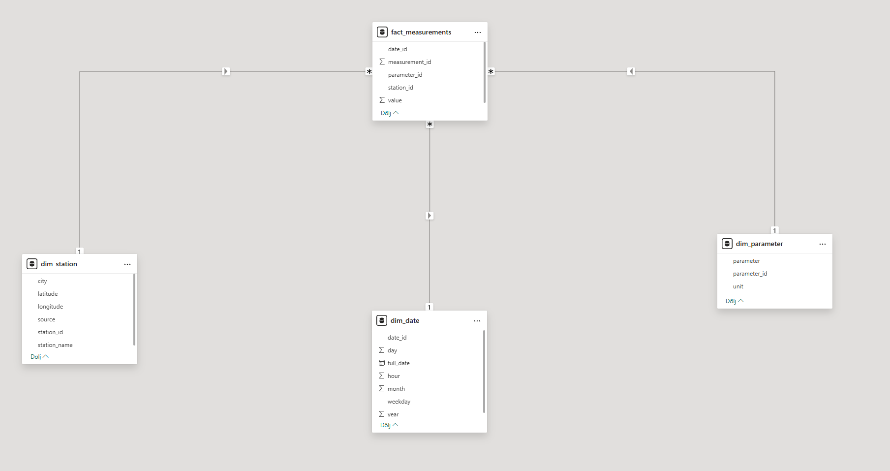
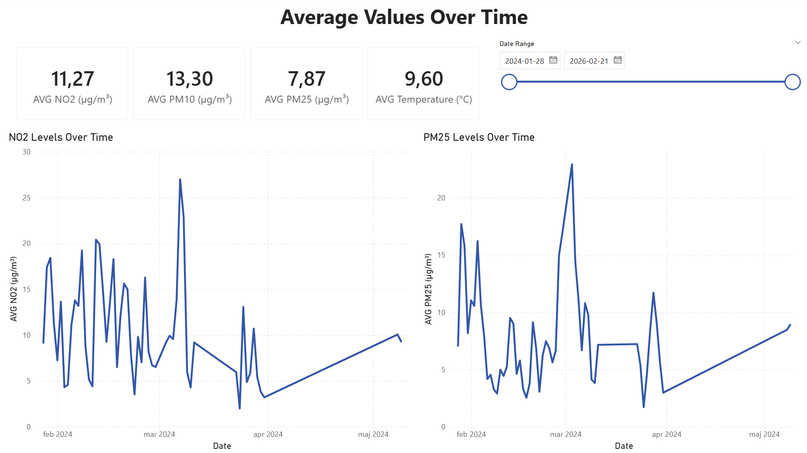
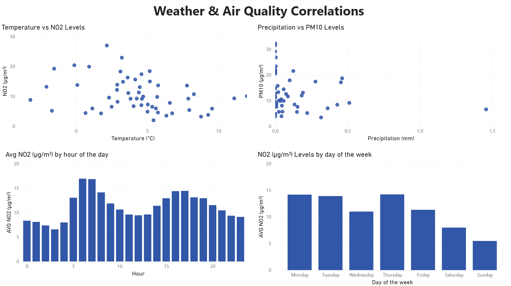
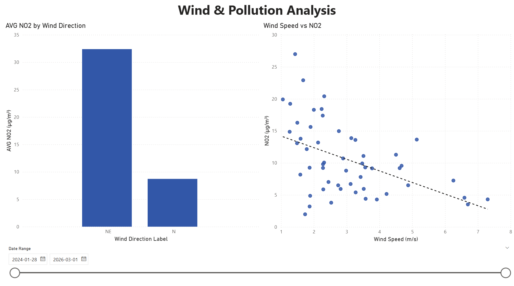

# Air Quality Analytics Pipeline

## Overview
An automated ETL pipeline that collects real-time weather and air quality data 
from Gothenburg, Sweden, loads it into a SQL Server database and visualizes 
the results in a Power BI dashboard. The goal is to analyze how weather 
conditions such as temperature, wind speed and precipitation affect air 
quality levels (NO2, PM10, PM25).

Weather data is collected from SMHI's open API (station: Göteborg A) and 
air quality data from OpenAQ (station: Göteborg Femman).

## Tech Stack
- **Python** - data extraction and transformation
- **SQL Server** - creation and storage of the data
- **Power BI** - deeper analysis of correlation between weather and air quality
- **Libraries** - `pandas`, `pyodbc`, `sqlalchemy`, `requests`, `python-dotenv`

## Architecture

The pipeline follows an ETL structure:

1. **Extract** - Python scripts fetch raw data from SMHI and OpenAQ API's and
save it as json files locally
2. **Transform** - Raw JSON is cleaned, formatted and saved as CSV files
3. **Load** - The processed data is loaded into a SQL Server star schema database

### Star Schema


### Pipeline Run


### Database Model in Power BI


## Project Structure
```
Pipeline/
├── docs/
│   └── screenshots/        - Screenshots from different stages of the project
├── sql/
│   └── create_tables.sql   - SQL script for creating the database and schema
├── src/
│   ├── extract_airquality.py   - Extracts air quality data from OpenAQ API
│   ├── extract_weather.py      - Extracts weather data from SMHI API
│   ├── transform_airquality.py - Cleans and structures raw air quality data
│   ├── transform_weather.py    - Cleans and structures raw weather data
│   └── load.py                 - Loads processed data into SQL Server
├── pipeline.py             - Main entry point, runs the full ETL pipeline
└── data/                   - Raw and processed data (gitignored)
```

## Setup & Installation

### Prerequisites
- Python 3.10+
- Microsoft SQL Server
- Power BI Desktop
- OpenAQ API key (free at [openaq.org](https://openaq.org))

### Installation
1. Clone the repository
```bash
git clone https://github.com/Denillox/city-pipeline-airquality.git
cd city-pipeline-airquality
```

2. Create and activate a virtual environment
```bash
python -m venv .venv
.venv\Scripts\activate
```

3. Install dependencies
```bash
pip install -r requirements.txt
```

4. Create a `.env` file based on `.env.example`
```
OPENAQ_API_KEY=your_api_key_here
DB_SERVER=your_server_name_here
DB_NAME=AirQualityAnalytics
```

5. Set up the database by running `Pipeline/sql/create_tables.sql` in SSMS

## How to Run
Run the full ETL pipeline with a single command from the root directory:

```bash
python pipeline.py
```

This will:
1. Fetch latest data from SMHI and OpenAQ APIs
2. Clean and transform the raw data
3. Load everything into the SQL Server database

Logs are saved to `pipeline.log` after each run.

## Dashboard Insights
Analysis of air quality and weather data from Gothenburg (Jan-May 2024)
revealed several interesting patterns:

- **Rush hour pollution** — As can be seen in Page 2 of the report, NO2 levels peak sharply at 6-7am
and again around 15-16pm, clearly reflecting morning and afternoon commuter traffic.
- **Weekend effect** — Looking at Page 3 of the report, weekdays clearly show significantly higher NO2 than weekends,
with Sunday being the cleanest day - roughly half the NO2 of a typical weekday.
- **Wind dispersal** — A clear negative correlation exists between wind speed and NO2 levels. Higher wind
speeds consistently result in lower pollution, confirming that wind disperses urban emissions effectively.
- **Temperature correlation** — Lower temperatures tend to coincide with higher NO2, likely due to increased heating
emissions and reduced atmospheric mixing in cold air.
- **March 2024 spike** — A notable pollution event occurred in mid-March 2024 
  where both NO2 and PM25 spiked simultaneously, suggesting a specific 
  weather or traffic event





## Known Limitations
- **Limited air quality data** — The OpenAQ API returns a maximum of 1000 
  measurements per sensor per request, limiting the air quality dataset to 
  roughly Jan–May 2024. This restricts the overlap period with the weather 
  dataset for correlation analysis. 
- **Data overlap** — Weather data spans Jan 2024–Mar 2026 while air quality 
  data only covers Jan–May 2024. Correlations between the two datasets are 
  therefore limited to this shorter window.
- **Single city** — The pipeline currently only collects data from Gothenburg. 
  Extending to multiple cities would allow for broader comparisons.
- **Parameter mapping bug** — During development, SMHI wind speed and wind 
  direction parameters were initially swapped. This was identified through 
  data quality checks and corrected before final analysis.

## Future Improvements
- Extend the pipeline to cover multiple Swedish cities for broader comparisons,
and different countries too
- Implement API pagination to retrieve more than 1000 measurements per sensor
- Schedule automatic pipeline runs using Windows Task Scheduler or Apache Airflow

## Data Sources
- **SMHI Open Data API** — Weather observations from station Göteborg A (ID: 71420).
  Parameters: temperature, wind speed, wind direction, precipitation.
  [opendata-download-metobs.smhi.se](https://opendata-download-metobs.smhi.se)

- **OpenAQ API v3** — Air quality measurements from station Göteborg Femman 
  (Location ID: 2163295). Parameters: NO2, PM10, PM25.
  [api.openaq.org](https://api.openaq.org)